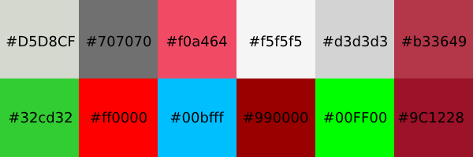
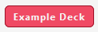
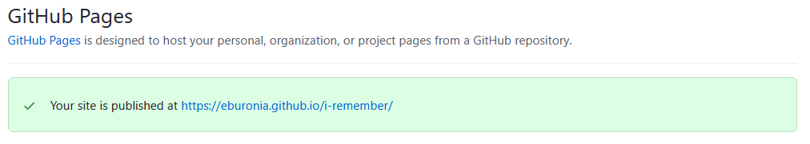
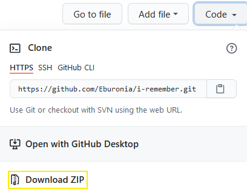

<h1 align="center">iRemember Spaced Repetition</h1>

<!-- Responsive Image -->

<!-- Links -->
View the Live project [link](https://eburonia.github.io/i-remember/) 
View the GitHub Repository [link](https://github.com/Eburonia/i-remember/)

<!-- About -->
## About
The purpose of this website is to create a so-called [spaced repetition](https://en.wikipedia.org/wiki/Spaced_repetition) system. In this system, using flashcards will help memorize certain information for the end-user by using spaced repetition. This information could be about languages (vocabulary) or other information.

There already exist spaced repetition systems on the internet. One of the most well-known is '[Anki](https://apps.ankiweb.net/)'. The desktop version of the application is popular among language learners and is also of high quality. You have to pay for the smartphone version of the application, but it is not that impressive.

The idea of the website creator was to create a free version of a spaced repetition system that end-users can use on a desktop or smaller devices.

The front side of a flashcard will show a question to the end-user on the screen. Then the end-user has to guess what has been written (answer) on the backside of the flashcard.

You add the answer to the system by using an input textbox on the desktop. The system will compare your answer with the information indicated on the backside of the flashcard. Typing on smaller devices works not very convenient. For this reason, the end-user has to tell the system whether the guessed answer to the question was correct by pressing the 'Correct' or 'Wrong' button.

A scoreboard is introduced into the system to keep track of the progress of the end-user.

End-users can create their own flashcard sets by using the 'Editor' page.
Download the flashcard set and practice them on the 'Practice' page or adjust them on the 'Editor' page.

<!-- Table of Contents -->
## Table of Contents

[User Experience (UX)](#UX)

[Features](#features)

[Technologies Used](#technologies)

[Testing](#testing)

[Known Bugs](#bugs)

[Deployment](#deployment)

[Credits](#credits)

<!-- User Experience (UX) -->

## User Experience (UX)

### User Stories

#### First-time Visitor Goals
1. As a first-time visitor of the website, I want to understand what the website's purpose is, so I can have an idea of whether I have ended up in the right place or not.
2. As a first-time visitor of the website, I want to navigate easily throughout the website, so I don't get frustrated not knowing where to click.
3. As a first-time visitor of the website, I want to find out quickly how to use the website, so I might not get frustrated by intuitively trying things on the website.
4. As a first-time visitor of the website, I want to practice an example flashcard set without having to create one first, so I can quickly see how the 'Practice' page looks and functions.
5. As a first-time visitor of the website, I want to create my own flashcard sets, so I can study whatever I want.
6. As a first-time visitor of the website, I want to have a user-friendly user interface, so I might not get annoyed or frustrated using the website.
7. As a first-time visitor of the website, I want to know what other end-users think of the website, so I can decide whether I might use the website or not.
8. As a first-time visitor of the website, I want to know if I can contact the creator of the website, so I can ask a question or provide some feedback.
9. As a first-time visitor of the website, I want additional information about a flashcard set, so I might not get confused when practicing a specific flashcard set.
10. As a first-time visitor of the website, I want to know how long it takes to get through a flashcard set, so I might not get frustrated because I have no idea how much time it will take.

#### Returning Visitor Goals
1. As a returning visitor of the website, I want to maintain my flashcard sets, so I can add or delete flashcards that are needed or not needed anymore.
2. As a returning visitor of the website, I want to re-use my created flashcard sets anytime, so I can keep practicing them.
3. As a returning visitor of the website, I want to use my created flashcard sets on different devices, so I can decide which device I might use when I want to practice.
4. As a returning visitor of the website, I want to see my progress, so I know whether I need to invest more time to increase my score.
5. As a returning visitor of the website, I want to practice my flashcards as long as I want, so I can decide how much time I am willing to invest in practicing a deck.
6. As a returning visitor of the website, I want to receive the latest information about the website, so I know when for example new features are implemented to the website.

### Design

#### Colour Scheme
The following colours were used throughout the webpage:
   - Hex: #D5D8CF: light green colour
      - Main colour on website, used in header, footer, and main content.
   - Hex: #707070: dark gray colour
      - Colour used in navigation bar, website logo, headings, paragraphs,  footer, practice page, and deck editor page.
   - Hex: #f04a64: orange-pink colour
      - Colour used in buttons, website logo, links, hover colour, and active page links.
   - Hex: #f5f5f5: whitesmoke colour
      - Colour used as background colour in division sections, and text of buttons.
   - Hex: #d3d3d3: lightgray colour
      - Colour used in disabled buttons practice page.
   - Hex: #b33649: dark red colour
      - Colour used for button hover.
   - Hex: #32cd32: green colour
      - Colour used in 'correct' button (pressed) on practice page.
   - Hex: #ff0000: red colour
      - Colour used in scoreboard (wrong answers), and 'wrong' button on practice page.
   - Hex: #00bfff: deepskyblue colour
      - Colour used in 'show answer' button, and answer field on practice page.
   - Hex: #990000: crimson colour
      - Colour used in 'wrong' button (pressed) on practice page.
   - Hex: #00FF00: limegreen colour
      - Colour used in scoreboard (correct answers), and 'correct' button (pressed) on practice page.

 
Colour scheme

#### Typography
- Not much attention is given to selecting a proper font-type as long it's a well-readable font. 'Segoe UI' is the only font-type used throughout the website and is a well-readable font type. 'Tahoma'; 'Geneva'; 'Verdana'; and 'sans-serif' set as a fallback font-type.
- The website logo was created by using the 'Glacial Indifference' font-type.

 
Segoe UI font-type

#### Imagery
The website is created for learning purposes. Except for the website logo and images on the manual page, no additional images are implemented on the website. The website logo is responsive for smaller devices.

#### Wireframes
Wireframes belonging to the website's project have been made in [Adobe XD](https://www.adobe.com/products/xd.html). Images are implemented in markdown files and can be found here:
- Wireframes of the 'Index' Page - [link](assets/wireframes/wireframes-index.md)
- Wireframes of the 'Practice' Page - [link](assets/wireframes/wireframes-practice.md)
- Wireframes of the 'Editor' Page - [link](assets/wireframes/wireframes-editor.md)
- Wireframes of the 'How to use' Page - [link](assets/wireframes/wireframes-manual.md)
- Wireframes of the 'Contact' Page - [link](assets/wireframes/wireframes-contact.md)

All wireframes were designed for three different devices:
- Desktop - Web: maximum viewport width 1920px
- iPad - Nexus 9: maximum viewport width 768px
- iPhone - 12 Pro Max: maximum viewport width 428px

#### Mockups
Due to the limited available time of the web developer, mockups have not been created.
Instead, an image of the responsive design has been added on top of this README file.

<!-- Features -->

## Features

### Header
A header has been added on top of every page and exists out of the website logo, and a navigation bar. The background colour used for the header is a light green colour as described in the colour scheme section in this README file. The navigation bar will change to a 'hamburger-style' navigation menu on smaller devices (e.g. iPad or smartphone). By hovering the navigation bar anchor links, the colour will change from a dark gray colour to an orange-pink colour as described in the colour scheme section of this README file and making it clear to the end-user this is a clickable link. Active pages are indicated with an orange-pink colour and a stripe above the active link. The company logo on the top left-hand side of the header has a clickable anchor link assigned to it which will always redirect the website to the index page. The Company logo will automatically resize for smaller devices. 

### Footer
A footer has been added on the bottom of every page and exists out of social media links, and a copyright notice. The same background colour has been chosen as in the header (light green) while the social media links are styled in a dark gray colour. By hovering the social media link icons, the colour will change from a dark gray colour to an orange-pink colour as described in the colour scheme section of this README file and makes it clear to the end-user these are clickable links. The icons used for the social media links are directly loaded from the [fontawesome](https://www.fontawesome.com) website. All social media links will be opened on a new blank page. A clear copyright notice is visible at the bottom of the footer which will be resized on smaller devices.

### Index Page
The index page is a simple page that tells the end-user what the purpose of the website is. For that reason, an 'about' section has been added to the index page.

### Practice Page
The practice page exists out of two sections. In the first section, you have to import a flashcard set into the system by first clicking the 'Browse' button, then select a deck (text-file .txt), and then by clicking the 'Load Deck' button, the second section will be shown on the screen which is the practice screen. You can also press the 'Example Deck' button. It will show the end-user an example flashcard set in the practice section.

When the end-user has loaded a deck, the practice interface will show up on the screen. It starts with the title 'PRACTICE FLASHCARDS' telling the end-user is in the practice section of the page.

Below that is the 'Deck name' indicated and is equal to the imported file (.txt) name. Then indicated, we have the 'shown card number' and the 'total amount of cards' inside the deck. Every time a new card shows up on the screen, the 'shown card number' will increase by 1 until it reaches the 'total amount of cards.'

We have a 'question field' and an 'answer field' nested in one division.
The 'question field' has a title that is equal to the card's front-side title which you can change in the editor and the 'answer field' has a title that is equal to the card back-side title which you can also change in the editor.

Then we have the 'answer textbox' and a 'show answer' button. When pressing the button, it shows the answer to the question. Above the 'answer textbox,' a scoreboard is indicated. Telling the end-user how many cards guessed 'correct' and how many guessed 'wrong.'

On smaller devices, the practice interface looks different. 
Typing answers on smaller devices is not really convenient for the end-user, and for that reason, the 'answer-textbox' is replaced with 3 buttons: the 'Wrong' button, 'Answer' button, and 'Correct' button. Here the end-user has to tell the system whether he knew the correct answer or not.
By guessing the answer and comparing it with the back-side of the card (by pressing the 'Answer' button), the end-user has then to press the 'Wrong' or 'Correct' button.

Proper styling has been done regarding the colours, see 'colour scheme' section in this README file for more information.

### Editor Page
To create or modify flashcard sets, the end-user has to open the 'Editor' page. Modifying an existing flashcard set is done by pressing the 'Browse' button, then select a deck file (.txt), and then press the 'Load Deck' button to import the deck on the editor screen.

Creating a new deck is done by pressing the 'New Deck' button.
The end-user can change the following fields in the deck editor:
   * Deck name (description of deck and file name)
   * Front-side (description of flashcards front-side, will show-up in practice screen)
   * Back-side (description of flashcards back-side, will show-up in practice screen)
   * Flashcards (front-side and back-side)

New flashcards will be added by pressing the 'Add Card' button.
For every flashcard, the end-user can adjust the front-side, and back-side.

Some special characters cannot be used because they are part of creating the deck file, these are |, +, <, >.

Deleting flashcards can be done by pressing the button with the 'Recycle Bin' icon on it.

When all necessary deck information and flashcards are added, the end-user can generate a deck by pressing the 'Export' button. A deck (.txt) file will be generated and the end-user can save it then.

By opening the 'Practice' page, the generated deck can then be imported.

Proper styling has been done regarding the colours, see 'colour scheme' section in this README file for more information.

### How to Use Page
The 'how to use page' tells the end-user how the 'practice' and 'editor' pages function utilizing a small manual including images.

### Contact Page
On the 'contact' page you can find a submission form including 3 text fields (first name, last name, e-mail address) and a text area (your message). All fields are mandatory fields and need to be filled in before you can press the 'Submit' button. When done correctly, a message will be shown on the screen telling the end-user the form input has been sent or not.

### h2 Heading
Every page as a h2 heading added describing the main purpose of the page. For consistency, sizing and colour (dark gray) of the h2 heading are chosen all the same on every page.

### Paragraphs
For consistency, sizing and colour (dark gray) of the 
 paragraphs are chosen all the same on every page.

### Links
The only links on the website you can find are in the navigation bar/menu.

### Buttons
For consistency, all buttons are sized and styled the same way. A dark red colour for the border, an orange/pink background colour, and a smokewhite colour for the fonts are used. 

 
Typical call for action button

### Responsiveness
All pages are responsive on all devices. Designed for minimum viewport width of: 320px.

### Accessibility
* All images have been foreseen with an alternative (alt) text in case the image cannot be loaded. This also helps the screen readers.
* Aria-labels have been introduced where needed to give important information to the screen readers.

### Future Features
* The project is very basically executed at this moment, a future feature could be working with a database so the end-user can save his flashcard sets over there. This is to avoid the not so user-friendly way of storing your flashcard sets right now (every time downloading when you have created a new flashcard set or when you have adjusted your flashcard set).
* Also, the statistics at the moment are not spectacular and can be expanded and stored in a database. You could think of how many times a card has been shown to the end-user or decrease the amounts of cards that will be shown to the end-user in case the end-user always guests the answer correctly. 

<!-- Technologies Used -->

## Technologies Used

### Languages Used
- [HTML5](https://en.wikipedia.org/wiki/HTML5)
- [CSS3](https://en.wikipedia.org/wiki/CSS)
- [JavaScript](https://en.wikipedia.org/wiki/JavaScript)
- [jQuery](https://en.wikipedia.org/wiki/JQuery)

### Frameworks, Libraries and Programs Used
- [jQuery v3.5.1](https://jquery.com/download/) - jQuery which is a JavaScript Library mainly used for manipulating the HTML DOM tree, is used throughout the website especially on the 'Practice' and 'Editor' page.
- [Font Awesome](https://www.fontawesome.com/) - Font Awesome icons are used on the website for linking to the social media pages and in h2 headings.
- [Git](https://git-scm.com/) - Git was used for version control and code change tracking of the website project. The terminal in Gitpod was used to commit and to push the project to the Github repository.
- [Github](https://github.com/) - The project code has been stored on the Github website.
- [GitPod](https://www.gitpod.io/) - GitPod was used for creating the code, testing of the website, commiting, and pushing the code to the github repository. 
- [Adobe XD](https://www.adobe.com/products/xd.html) - Adobe XD was used to create the website's Wireframes. To see the Wireframes, go to the Design section above to see the results.
- [Photopea.com](https://www.photopea.com/) - The Photopea website is used for creating the website logo and README files images.
- [EmailJS](https://www.emailjs.com/) - EmailJS is used to send emails from the contact page form to the website owner's e-mail address directly from the client-side JavaScript code.

<!-- Testing -->

## Testing

### Functionality Checklist

#### Common
- Check aria labels. **(checked)**
- Check alternative 'alt' text. **(checked)**
- Check the spelling of the page content. **(checked)**

#### Header/Navigation Bar
- Check whether the header is always on top of the page. **(checked)**
- Check whether the iRemember logo links back to the index page. **(checked)**
- Check the 'Active' page in the navigation bar and the remaining links change colour while hovering. **(checked)**
- Check for dead links. **(checked)**
- Check the responsiveness of the navigation bar (change to hamburger-style navigation). **(checked)**
- Check whether there is no overflow while reducing the screen size. **(checked)**

#### Footer
- Check whether the footer is always at the bottom of the page. **(checked)**
- Check whether all social media links are working properly and are opening a new blank page. **(checked)**
- Check whether the social media links change colour while being hovered. **(checked)**
- Check for dead links. **(checked)**
- Check the responsiveness of the footer when changing the size of the viewport. **(checked)**

#### Index Page
- Check for dead links. **(checked)**
- Check the responsiveness of the sections when changing the size of the viewport. **(checked)**

#### Practice Page
- Check the responsiveness of the menu sections when changing the size of the viewport. **(checked)**
- ...

#### Editor Page
- Check the responsiveness of the menu sections when changing the size of the viewport. **(checked)**
- ...

#### Manual Page
- Check the responsiveness of the menu sections when changing the size of the viewport. **(checked)**
- ...

#### Contact Page
- Check the responsiveness of the menu sections when changing the size of the viewport. **(checked)**
- ...

#### 404 Page
- Check whether 404 page loads when entering a wrong link address. **(checked)**
- Check the 'back to homepage' anchor link is going to the index page'. **(checked)**

### Usability Testing
- Family and friends were asked to test the website and to navigate through all four website pages. Buttons, links, and forms were tested by them.

**CHECK**
 
iPhone 5 screenshot

### Compatibility Testing
The following browsers were used for compatibility testing:
- Firefox
- Google Chrome
- Microsoft Edge  
See 'Known Bugs' section for more information about the outcome.

### Further Testing
The following devices were used for testing the website:
- Desktop: Asus ZenBook (viewport: 1920px * 1080px) 
- Smartphone: Samsung S9+ (viewport: 360px * 740px)
- Smartphone: iPhone 11 (viewport: 414px * 896px)

During the building of the website, [Google Chrome DevTools](https://developer.chrome.com/) was used to simulate different viewport sizes.
The website is designed for a minimum viewport width of 320px (iPhone 5 size).

### Testing Code
The following online validators were used to check whether the website generated any html and CSS syntax errors:

#### W3C Markup Validator

W3C Markup Validator, results of English language pages:
* [index.html](https://validator.w3.org/nu/?doc=https%3A%2F%2Feburonia.github.io%2Fi-remember%2Findex.html)
* [practice.html](https://validator.w3.org/nu/?doc=https%3A%2F%2Feburonia.github.io%2Fi-remember%2Fpractice.html)
* [editor.html](https://validator.w3.org/nu/?doc=https%3A%2F%2Feburonia.github.io%2Fi-remember%2Feditor.html)
* [manual.html](https://validator.w3.org/nu/?doc=https%3A%2F%2Feburonia.github.io%2Fi-remember%2Fmanual.html)
* [contact.html](https://validator.w3.org/nu/?doc=https%3A%2F%2Feburonia.github.io%2Fi-remember%2Fcontact.html)
* [404.html](https://validator.w3.org/nu/?doc=https%3A%2F%2Feburonia.github.io%2Fi-remember%2F404.html)

**CHECK**
No errors found.

#### W3C CSS Validator

W3C CSS Validator, results of the style sheets:
* [header.css](https://jigsaw.w3.org/css-validator/validator?uri=https%3A%2F%2Feburonia.github.io%2Fi-remember%2Fassets%2Fcss%2Fheader.css&profile=css3svg&usermedium=all&warning=1&vextwarning=&lang=en)
* [footer.css](https://jigsaw.w3.org/css-validator/validator?uri=https%3A%2F%2Feburonia.github.io%2Fi-remember%2Fassets%2Fcss%2Ffooter.css&profile=css3svg&usermedium=all&warning=1&vextwarning=&lang=en)
* [index.css](https://jigsaw.w3.org/css-validator/validator?uri=https%3A%2F%2Feburonia.github.io%2Fi-remember%2Fassets%2Fcss%2Findex.css&profile=css3svg&usermedium=all&warning=1&vextwarning=&lang=en)
* [practice.css](https://jigsaw.w3.org/css-validator/validator?uri=https%3A%2F%2Feburonia.github.io%2Fi-remember%2Fassets%2Fcss%2Fpractice.css&profile=css3svg&usermedium=all&warning=1&vextwarning=&lang=en)
* [editor.css](https://jigsaw.w3.org/css-validator/validator?uri=https%3A%2F%2Feburonia.github.io%2Fi-remember%2Fassets%2Fcss%2Feditor.css&profile=css3svg&usermedium=all&warning=1&vextwarning=&lang=en)
* [manual.css](https://jigsaw.w3.org/css-validator/validator?uri=https%3A%2F%2Feburonia.github.io%2Fi-remember%2Fassets%2Fcss%2Fmanual.css&profile=css3svg&usermedium=all&warning=1&vextwarning=&lang=en)
* [contact.css](https://jigsaw.w3.org/css-validator/validator?uri=https%3A%2F%2Feburonia.github.io%2Fi-remember%2Fassets%2Fcss%2Fcontact.css&profile=css3svg&usermedium=all&warning=1&vextwarning=&lang=en)
* [404.css](https://jigsaw.w3.org/css-validator/validator?uri=https%3A%2F%2Feburonia.github.io%2Fi-remember%2Fassets%2Fcss%2F404.css&profile=css3svg&usermedium=all&warning=1&vextwarning=&lang=en)

**CHECK**
No errors found.

**ADD JAVASCRIPT CHECKER**

### Testing Grammar and Spelling 
- [Grammarly.com](https://www.grammarly.com/) was used to check grammar and spelling.

### Testing User Stories from User Experience (UX) Section

#### First-time Visitor Goals
1. As a first-time visitor of the website, I want to understand what the website's purpose is, so I can have an idea of whether I have ended up in the right place or not.
   * In the upper left corner in the navigator bar, a website logo stating 'iRemember Spaced Repetition' already suggests what the website might be about.
   * The index page starts with an about section, clearly stating what the purpose of the website is.
   * In the navigator bar, there is a link to the 'how to use' page which also gives you information about the purpose of the website.
   * In case the end-user still has questions about the website, he can use the contact form on the contact page to send a question or provide feedback to the website owner.

2. As a first-time visitor of the website, I want to navigate easily throughout the website, so I don't get frustrated not knowing where to click.
    * A navigation bar has been added to every page in the upper right corner of the website including all available pages on the website.
   * On smaller devices (iPad and smartphones) the navigation bar is executed as a so-called 'hamburger-style' navigation menu.

3. As a first-time visitor of the website, I want to find out quickly how to use the website, so I might not get frustrated by intuitively trying things on the website.
   * On the index page, a link to the 'how to use' page has been implemented in the 'about' section. Also in the navigation bar/menu the same link has been implemented.

4. As a first-time visitor of the website, I want to practice an example flashcard set without having to create one first, so I can quickly see how the 'Practice' page looks and functions.
   * An example flashcard set has been implemented on the 'practice' page. By pressing the 'Example Deck' button, the example flashcard set existing out of 20 cards will be loaded on the practice screen. In this card set, you have to guess the capital cities of 20 European countries. 

5. As a first-time visitor of the website, I want to create my own flashcard sets, so I can study whatever I want.
   * A special 'Editor' page has been implemented on the website. Here you can 'create' a new flashcard set, import and adjust an existing flashcard set, and download your created/adjusted flashcard sets. You can give a description to your flashcard sets, and give a description to the front-side and back-side of your flashcards.
   * On the 'Practice' page you can import your created flashcard sets by clicking the 'Browse' and 'Load Deck' buttons.

6. As a first-time visitor of the website, I want to have a user-friendly user interface, so I might not get annoyed or frustrated using the website.
   * The 'Practice' page of the website functions differently on a desktop and smaller devices. On the desktop, you have 'direct input' for the answer using a 'textbox'. This can be done here because direct input from the keyboard works conveniently. On smaller devices, direct input does not function that well. For this reason, the 'textbox' has been replaced by buttons (show answer, correct answer, and wrong answer). While on the desktop version the system checks your answer, on smaller devices you have to tell the system whether your answer was correct or not by pressing the 'correct' or 'wrong' button.
   * The 'Editor' page works the same on desktop and smaller devices. It is advised to use the 'Landscape Mode' of the phone when using the 'Editor' page for the sake of convenience.

7. As a first-time visitor of the website, I want to know what other end-users think of the website, so I can decide whether I might use the website or not.
   * Social media links are added to the 'Footer' section of every page. On the indicated social media platforms, the end-user can comment or discuss with other end-users on these platforms about the website.

8. As a first-time visitor of the website, I want to know if I can contact the creator of the website, so I can ask a question or provide some feedback.
   * A special 'Contact' page has been added to the website which can be accessed in the website's navigation bar/menu. A link to the page is also mentioned in the 'About' section on the 'Index' page.
   * On the 'Contact' page a contact form has been implemented. Here the end-user can add information about himself (first name, last name, e-mail address) and of course the message you want to send to the website owner. The sent e-mail will end up in the mailbox of the website owner.

9. As a first-time visitor of the website, I want additional information about a flashcard set, so I might not get confused when practicing a specific flashcard set.
   * On the 'Editor' page, a summary of a flashcard set will be shown to the end-user. Next to the flashcards themselves, 3 additional fields are implemented on top of the summary: 'Deck description', 'Front-side description', and 'Back-side description'. This gives the end-user additional information about the flashcard set. Not only on the 'Editor' page but this information will also be shown on the 'Practice' page when you have loaded a deck. These fields can be for example: 
      * Deck description: Vocabulary English-Spanish
      * Front-side description: English
      * Back-side description: Spanish

10. As a first-time visitor of the website, I want to know how long it takes to get through a flashcard set, so I might not get frustrated because I have no idea how much time it will take.
    * On the 'Practice' page, it clearly states how many cards there are in the loaded flashcard set. It also states how many cards have been shown so far. This looks as following: CARD 8 OF 26 SHOWN.

#### Returning Visitor Goals
1. As a returning visitor of the website, I want to maintain my flashcard sets, so I can add or delete flashcards that are needed or not needed anymore.
   * On the 'Editor' page, you can adjust your flashcards, delete your flashcards, or add new flashcards.

2. As a returning visitor of the website, I want to re-use my created flashcard sets anytime, so I can keep practicing them.
   * You need to download your created flashcard sets (.txt file will be generated) to re-use them for practicing purposes.

3. As a returning visitor of the website, I want to use my created flashcard sets on different devices, so I can decide which device I might use when I want to practice.
   * You need to download your created flashcard set (.txt file will be generated) to re-use them for practicing purposes. In case you want to use the generated .txt files on your smaller devices, you have to import them on your smartphone or iPad and load them into the website.

4. As a returning visitor of the website, I want to see my progress, so I know whether I need to invest more time to increase my score.
   * On the 'Practice' page, a scoreboard has been implemented. It shows the end-user how many cards have been guessed 'correct' and how many 'wrong'.

5. As a returning visitor of the website, I want to practice my flashcards as long as I want, so I can decide how much time I am willing to invest in practicing a deck.
   * When the end-user got through the selected flashcard set. Two buttons will show up 'Replay Deck' or 'Other Deck'. Here you can replay your active flashcard set or select another flashcard set.

6. As a returning visitor of the website, I want to receive the latest information about the website, so I know when for example new features are implemented to the website.
   * The latest news about the website and new features will be shared on the website's 'Twitter' and 'Facebook' pages. Links to the website's social media pages can be found in the footer of every page.

<!-- Known Bugs -->

## Known Bugs
- Aria labels in division buttons are not accepted in the W3C Markup Validator, a warning is shown (Possible misuse of aria-label). These aria-labels are removed from the code.
- The wireframe PDF files are not loaded correctly on screen in the GitHub repository (the first page won't show up). To see the full content of the PDF file, press the download button.

**CHECK**

<!-- Deployment -->

## Deployment

### Publishing
'GitHub Pages' was used for publishing the website. The procedure was as follows:
1. Login to the [GitHub](https://www.github.com/) website.
2. On the left side of your screen, you can find a summary of all your repositories. Select [Eburonia/i-remember](https://github.com/Eburonia/i-remember)
3. You can find a ribbon on the top of your screen. In the ribbon, click on 'Settings'.
4. In the selection menu on the left side of your screen, click on 'Pages'.
5. Beneath 'Source' you will find a small pull-down menu. Click on it and select 'main', then press the 'Save' button.
6. You will get automatically redirected to the 'GitHub Pages' page. There you will see a blue text box telling the site will be published.
7. Refresh the page after a minute and when this text box turns green, the website has been published.
8. Click the link in the green text box to go to your published website.

### Forking
If you want to make a copy of the repository you can Fork it without changing the original repository by following the next procedure:
1. Login to the [GitHub](https://www.github.com/) website.
2. On the left side of your screen, you can find a summary of all your repositories. Select [Eburonia/i-remember](https://github.com/Eburonia/i-remember)
3. On the right side of your screen, next to 'Unwatch' pull-down menu, and the 'Star' button, you can find the 'Fork' button.
4. By clicking this button, it will create a copy of the website in your repository.

### Cloning
You can clone the repository by following the next procedure:
1. Login to the [GitHub](https://www.github.com/) website.
2. On the left side of your screen, you can find a summary of all your repositories. Select [Eburonia/i-remember](https://github.com/Eburonia/i-remember)
3. Click on the 'Code' button next to the Green 'GitPod' button.
4. Click on 'HTTPS' and copy the hyperlink below it.
5. Go to the repository where you want to make a clone of the website. Or create a new repository.
6. When in this repository, select the folder or create a folder where you want to clone the directory.
7. Go to the terminal and type: 'Git Clone (copied link)' and press enter. The directory has been cloned now.

### Downloading
You can download the repository by following the next procedure:
1. Login to the [GitHub](https://www.github.com/) website.
2. On the left side of your screen, you can find a summary of all your repositories. Select [Eburonia/i-remember](https://github.com/Eburonia/i-remember)
3. Click on the 'Code' button next to the Green 'GitPod' button and then click on 'Download ZIP'.
4. A .zip file of the repository content will be downloaded. 

<!-- Credits -->

## Credits

### Code
- Most of all HTML, CSS, jQuery and JavaScript code was written by the website creator: Maurice Vossen
- The generate a file and download it on the 'Editor' page has been copied from [here](https://ourcodeworld.com/articles/read/189/how-to-create-a-file-and-generate-a-download-with-javascript-in-the-browser-without-a-server). The code has been adjusted by the website creator. 
- The submission form JavaScript code on the 'Contact' page is coming from the Code Institude's webinar about EmailJS.
- The JavaScript code for importing a .txt file content on the 'Practice' and 'Editor' page has been copied from [here](https://usefulangle.com/post/193/javascript-read-local-file). The code has been adjusted by the website creator.
- Many jQuery code examples were found on the internet which gave the website creator information on how to implement certain code on this website, especially the [stackoverflow](https://www.stackoverflow.com) website gave a lot of information.

### Content

#### README file
For the sake of consistency, the README file of the website creator's previous project ([Japanese Restaurant Shibuya](https://github.com/Eburonia/japanese-restaurant-shibuya)) was used as a basis for the README file of this project.

#### Index Page
All content on the 'Index' page was written by the website creator.

#### Manual Page
All content on the 'Manual' page was written by the website creator.

### Media

#### Images
- The website logo was created by the website creator.
- All images on the 'How to Use' page were created by the website creator.

 
....

### Acknowledgements
- Thanks to my personal mentor Maranatha Ilesanmi for answering my questions and giving feedback to this project.
- The many free coding forums on the internet, especially [Stackoverflow.com](https://www.stackoverflow.com/) for providing answers to my coding questions. Most of my questions were already asked by other users of the stackoverflow website, making it easy to find quick answers.

